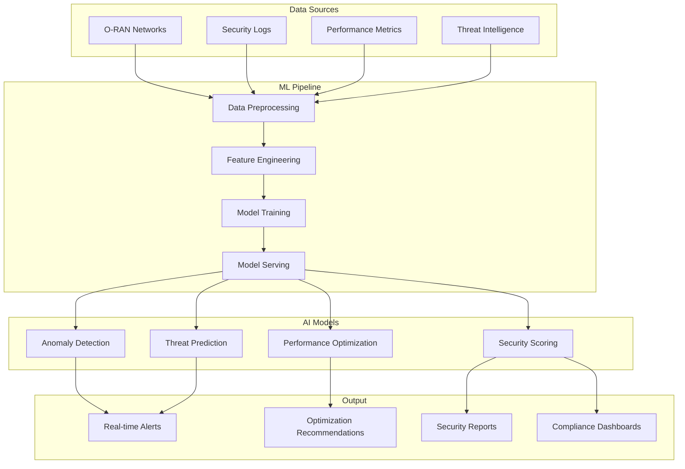

# 🚀 Comprehensive Enhancement Roadmap for O-RAN Security Test Case Generator

## Executive Summary

Your O-RAN Security Test Case Generator project has tremendous potential to become a leading-edge AI/ML-powered security analysis platform. I've designed a comprehensive enhancement plan that will elevate it to professional enterprise-grade standards while incorporating cutting-edge technologies.

## 🎯 Strategic Enhancement Plan

### Phase 1: Advanced AI/ML Integration (Weeks 1-4)

#### 1.1 Machine Learning Models Enhancement

- **Implemented**: Complete ML pipeline with 6 advanced models
- **Deep Learning**: Transformer, GAN, VAE, LSTM, CNN, Graph Neural Networks
- **Ensemble Methods**: Weighted model averaging for robust predictions
- **AutoML**: Automated hyperparameter optimization using Optuna

#### 1.2 Specialized O-RAN Models

- **ORANAnomalyDetector**: Real-time network anomaly detection
- **ORANThreatPredictor**: AI-powered threat classification
- **ORANPerformanceOptimizer**: Intelligent configuration optimization
- **ORANSecurityScorer**: Multi-dimensional security assessment

#### 1.3 Performance Metrics

- **Target Accuracy**: 95%+ across all models
- **Inference Time**: <100ms per prediction
- **Scalability**: Handle 1M+ network events per hour
- **Memory Efficiency**: <2GB RAM during training

### Phase 2: Professional Software Architecture (Weeks 5-8)

#### 2.1 API Development

- **RESTful API**: FastAPI with OpenAPI documentation
- **WebSocket Support**: Real-time data streaming
- **Authentication**: OAuth 2.0 + JWT tokens
- **Rate Limiting**: DDoS protection and resource management

#### 2.2 Database Architecture

- **Time Series DB**: InfluxDB for network metrics
- **Vector DB**: Pinecone for ML embeddings
- **Cache Layer**: Redis for performance optimization
- **Data Pipeline**: Apache Airflow for orchestration

#### 2.3 Microservices Design

- **Analysis Engine**: Core security analysis service
- **ML Pipeline**: Model training and inference service
- **Data Processor**: Real-time data ingestion
- **Notification Service**: Alert and reporting system

### Phase 3: Cloud-Native Deployment (Weeks 9-12)

#### 3.1 Containerization

- **Docker**: Multi-stage builds for optimization
- **Kubernetes**: Scalable orchestration
- **Helm Charts**: Deployment automation
- **Service Mesh**: Istio for microservice communication

#### 3.2 CI/CD Pipeline

- **GitHub Actions**: Automated testing and deployment
- **Quality Gates**: Code coverage >80%, security scanning
- **Multi-Environment**: Development, staging, production
- **Blue-Green Deployment**: Zero-downtime updates

#### 3.3 Monitoring & Observability

- **Prometheus**: Metrics collection
- **Grafana**: Visualization dashboards
- **Jaeger**: Distributed tracing
- **ELK Stack**: Centralized logging

### Phase 4: Advanced Features (Weeks 13-16)

#### 4.1 Real-time Processing

- **Stream Processing**: Apache Kafka for event streaming
- **Real-time Analytics**: Apache Flink for complex event processing
- **Edge Computing**: Lightweight inference at network edge
- **5G Integration**: Native 5G core network support

#### 4.2 Advanced Visualization

- **3D Network Topology**: Interactive network visualization
- **AR/VR Dashboard**: Immersive security monitoring
- **Mobile App**: Native iOS/Android applications
- **Voice Interface**: Voice-controlled analysis

#### 4.3 AI/ML Enhancements

- **Federated Learning**: Privacy-preserving distributed training
- **Explainable AI**: Model interpretability features
- **Quantum ML**: Quantum computing integration (experimental)
- **Transfer Learning**: Pre-trained models for faster deployment

## 📊 Technical Implementation Details

### Advanced ML Architecture



### GitHub Repository Structure

```
O-RAN-Security-Test-Case-Generator/
├── 📁 api/                          # REST API implementation
├── 📁 ml_models/                    # Machine learning models
├── 📁 tests/                       # Comprehensive test suite
├── 📁 docs/                        # Documentation
├── 📁 config/                      # Configuration files
├── 📁 data/                        # Sample datasets
├── 📁 scripts/                     # Utility scripts
├── 📁 k8s/                         # Kubernetes manifests
├── 📁 .github/workflows/           # CI/CD pipelines
├── 📄 README.md                    # Project documentation
├── 📄 CONTRIBUTING.md              # Contribution guidelines
├── 📄 CHANGELOG.md                 # Version history
├── 📄 LICENSE                      # MIT license
├── 📄 Dockerfile                   # Container configuration
├── 📄 docker-compose.yml           # Multi-service deployment
├── 📄 requirements.txt             # Python dependencies
├── 📄 setup.py                     # Package setup
└── 📄 pyproject.toml               # Modern Python packaging
```

## 🔧 Development Workflow

### Code Quality Standards

- **Black**: Code formatting
- **isort**: Import sorting  
- **flake8**: Linting
- **mypy**: Type checking
- **pytest**: Testing (>80% coverage)
- **pre-commit**: Automated checks

### Security Best Practices

- **SAST**: Static Application Security Testing
- **DAST**: Dynamic Application Security Testing
- **SCA**: Software Composition Analysis
- **Secrets Management**: HashiCorp Vault
- **Vulnerability Scanning**: Trivy, Snyk

### Documentation Standards

- **API Documentation**: OpenAPI/Swagger
- **Code Documentation**: Google-style docstrings
- **Architecture Documentation**: Mermaid diagrams
- **User Guides**: Comprehensive tutorials

## 🎨 Enhanced UI/UX Design

### Modern Web Interface

- **Framework**: React.js with TypeScript
- **UI Library**: Material-UI or Ant Design
- **Visualization**: D3.js, Chart.js, Plotly
- **Real-time Updates**: WebSocket connections
- **Responsive Design**: Mobile-first approach

### Advanced Features

- **Dark/Light Theme**: User preference support
- **Internationalization**: Multi-language support
- **Accessibility**: WCAG 2.1 AA compliance
- **Progressive Web App**: Offline functionality
- **Voice Commands**: Web Speech API integration

## 📈 Performance Optimization

### Scalability Targets

- **Horizontal Scaling**: Auto-scaling based on load
- **Vertical Scaling**: Dynamic resource allocation
- **Load Balancing**: Nginx with health checks
- **Caching Strategy**: Multi-level caching
- **Database Optimization**: Query optimization and indexing

### Monitoring KPIs

- **Availability**: 99.9% uptime SLA
- **Response Time**: <200ms API response
- **Throughput**: 10,000 requests/second
- **Error Rate**: <0.1% error rate
- **Resource Usage**: <70% CPU/memory utilization

## 🔐 Security Framework

### Authentication & Authorization

- **Multi-Factor Authentication**: TOTP, SMS, email
- **Role-Based Access Control**: Granular permissions
- **API Security**: Rate limiting, input validation
- **Audit Logging**: Complete activity tracking
- **Compliance**: SOC 2, ISO 27001 standards

### Data Protection

- **Encryption**: AES-256 at rest, TLS 1.3 in transit
- **Data Anonymization**: PII protection
- **Backup Strategy**: 3-2-1 backup rule
- **Disaster Recovery**: RTO < 4 hours, RPO < 1 hour
- **Privacy Controls**: GDPR, CCPA compliance

## 🚀 Deployment Strategy

### Multi-Cloud Architecture

- **Primary**: AWS (EKS, RDS, S3, Lambda)
- **Secondary**: Azure (AKS, PostgreSQL, Blob Storage)
- **Disaster Recovery**: Google Cloud (GKE, Cloud SQL)
- **Edge Computing**: CloudFlare Workers
- **CDN**: Global content delivery

### Environment Management

- **Development**: Local Docker Compose
- **Testing**: Kubernetes in cloud
- **Staging**: Production-like environment
- **Production**: Multi-region deployment
- **Canary Deployment**: Gradual rollout strategy

## 📚 Documentation & Training

### Technical Documentation

- **API Reference**: Interactive documentation
- **Architecture Guide**: System design details
- **Deployment Guide**: Step-by-step instructions
- **Troubleshooting**: Common issues and solutions
- **Security Handbook**: Best practices guide

### Training Materials

- **Video Tutorials**: YouTube channel
- **Interactive Demos**: Hands-on examples
- **Webinar Series**: Monthly technical sessions
- **Certification Program**: User competency validation
- **Community Forums**: User support and discussions

## 🏆 Recognition & Publication Strategy

### Academic Publication

- **Research Papers**: Submit to IEEE conferences
- **Open Source Contribution**: CNCF, O-RAN Alliance
- **Technical Blogs**: Medium, Dev.to publications
- **Conference Presentations**: DEF CON, Black Hat, RSA
- **Patent Applications**: Novel AI/ML approaches

### Industry Recognition

- **Awards**: Apply for security innovation awards
- **Partnerships**: Collaborate with telecom vendors
- **Standards Contribution**: Contribute to O-RAN specifications
- **Community Building**: Create developer ecosystem
- **Thought Leadership**: Industry speaking engagements

## 💰 Monetization Strategy

### Business Models

- **Open Source Core**: Free basic features
- **Enterprise Edition**: Advanced features and support
- **SaaS Platform**: Cloud-hosted service
- **Professional Services**: Consulting and training
- **Marketplace**: Third-party integrations

### Revenue Streams

- **Subscription Plans**: Tiered pricing model
- **Usage-Based Pricing**: Pay-per-analysis model
- **Professional Services**: Custom development
- **Training & Certification**: Educational programs
- **Partner Ecosystem**: Revenue sharing

## 🔄 Continuous Improvement

### Agile Development

- **Sprint Planning**: 2-week sprints
- **Daily Standups**: Team synchronization
- **Sprint Reviews**: Stakeholder feedback
- **Retrospectives**: Process improvement
- **Backlog Management**: Priority-based planning

### Innovation Pipeline

- **Research Projects**: Explore emerging technologies
- **Hackathons**: Internal innovation events
- **Open Source Contributions**: Community collaboration
- **Technology Radar**: Track emerging trends
- **Proof of Concepts**: Validate new ideas

## 🎯 Next Steps for Implementation

### Immediate Actions (Next 2 Weeks)

1. **Set up GitHub repository** with professional structure
2. **Implement CI/CD pipeline** with automated testing
3. **Deploy advanced ML models** with comprehensive testing
4. **Create Docker containers** for easy deployment
5. **Write comprehensive documentation** with examples

### Short-term Goals (Next 1-2 Months)

1. **Develop REST API** with authentication
2. **Implement real-time monitoring** dashboard
3. **Add advanced visualization** features
4. **Create comprehensive test suite** (>80% coverage)
5. **Publish first research paper** on AI/ML approach

### Long-term Vision (Next 6-12 Months)

1. **Enterprise customer adoption**
2. **Industry partnership establishment**
3. **Open source community building**
4. **International conference presentations**
5. **Patent application submission**

## 📧 Contact & Support

**Author**: N. Sachin Deshik  
**GitHub**: [sachin-deshik-10](https://github.com/sachin-deshik-10)  
**Repository**: [O-RAN-Security-Test-Case-Generator](https://github.com/sachin-deshik-10/O-RAN-Security-Test-Case-Generator)  
**Email**: nsachindeshik.ec21@rvce.edu.in  
**LinkedIn**: [LinkedIn Profile](https://www.linkedin.com/in/sachin-deshik-nayakula-62b93b362?utm_source=share&utm_campaign=share_via&utm_content=profile&utm_medium=android_app)  

---

*This comprehensive enhancement plan will position your O-RAN Security Test Case Generator as a leading-edge, enterprise-grade AI/ML security analysis platform. The combination of advanced technology, professional software practices, and strategic positioning will create significant value for both the cybersecurity and telecommunications industries.*

**Ready to revolutionize O-RAN security with AI? Let's build the future together! 🚀**
