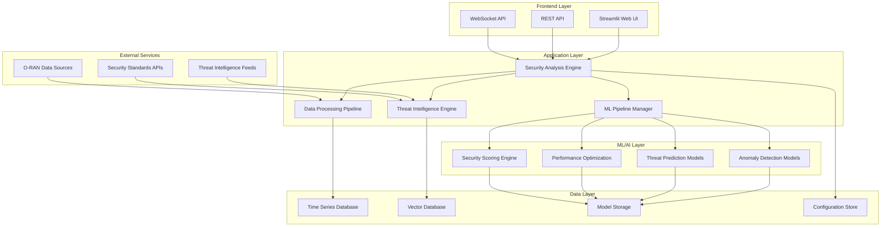
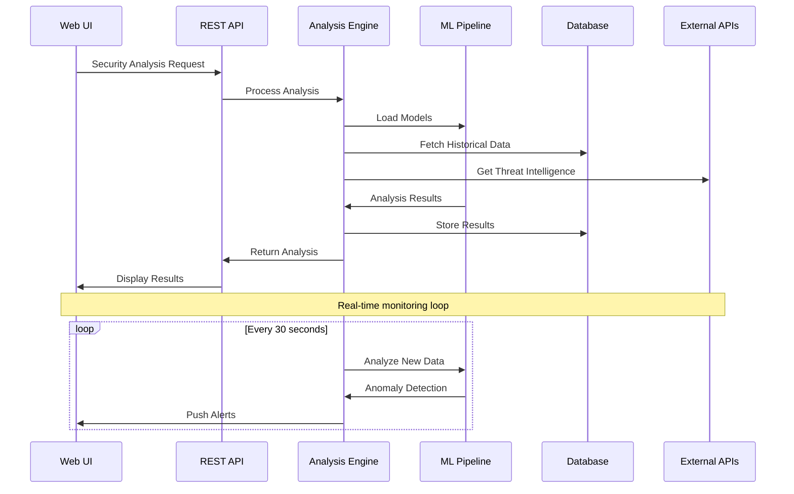
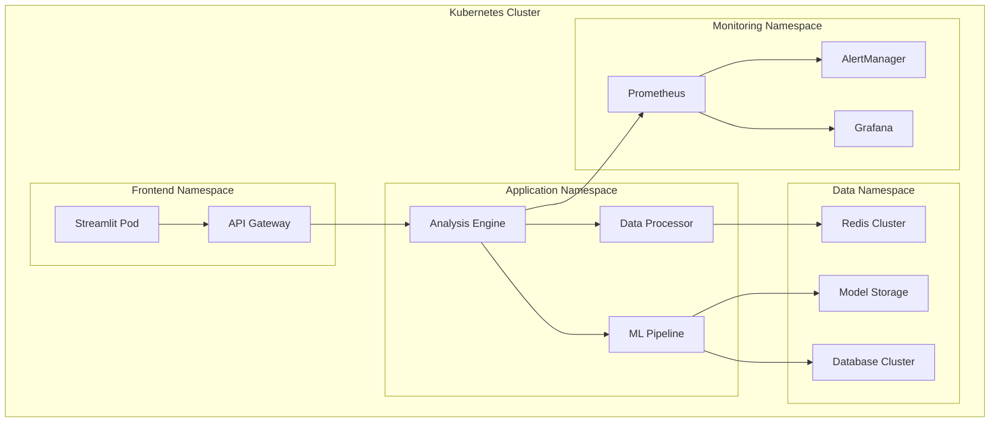
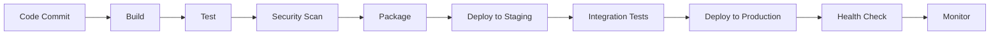

# System Architecture Documentation

## Overview

The O-RAN Security Test Case Generator is designed with a modular, scalable architecture that leverages advanced AI/ML techniques for comprehensive security analysis of O-RAN networks.

## Architecture Diagram

## Component Details

### 1. Frontend Layer

#### Streamlit Web UI

- **Purpose**: Interactive web interface for security analysis
- **Features**:
  - Real-time dashboards
  - Interactive visualizations
  - Configuration management
  - Report generation
- **Technology**: Streamlit, Plotly, Altair

#### REST API

- **Purpose**: Programmatic access to security analysis
- **Features**:
  - RESTful endpoints
  - Authentication & authorization
  - Rate limiting
  - API documentation
- **Technology**: FastAPI, Pydantic, OAuth2

#### WebSocket API

- **Purpose**: Real-time data streaming
- **Features**:
  - Live monitoring
  - Alert notifications
  - Bi-directional communication
- **Technology**: WebSockets, AsyncIO

### 2. Application Layer

#### Security Analysis Engine

- **Purpose**: Core security analysis orchestration
- **Components**:
  - Analysis workflow manager
  - Result aggregation
  - Report generation
  - Alert management

#### ML Pipeline Manager

- **Purpose**: Manages machine learning workflows
- **Components**:
  - Model lifecycle management
  - Training pipeline orchestration
  - Model serving
  - Performance monitoring

#### Data Processing Pipeline

- **Purpose**: Data ingestion and preprocessing
- **Components**:
  - Data validation
  - Feature engineering
  - Data transformation
  - Quality assurance

#### Threat Intelligence Engine

- **Purpose**: External threat intelligence integration
- **Components**:
  - Threat feed aggregation
  - Intelligence correlation
  - IOC management
  - Threat scoring

### 3. ML/AI Layer

#### Anomaly Detection Models

- **Isolation Forest**: Unsupervised outlier detection
- **LSTM Autoencoder**: Temporal pattern analysis
- **Transformer Models**: Sequential anomaly detection
- **VAE**: Variational autoencoder for complex patterns

#### Threat Prediction Models

- **Random Forest**: Ensemble threat classification
- **XGBoost**: Gradient boosting for threat scoring
- **Neural Networks**: Deep learning threat prediction
- **Graph Neural Networks**: Network topology analysis

#### Performance Optimization

- **Reinforcement Learning**: Configuration optimization
- **Genetic Algorithms**: Parameter tuning
- **Bayesian Optimization**: Hyperparameter optimization
- **Multi-objective Optimization**: Trade-off analysis

#### Security Scoring Engine

- **Weighted Scoring**: Multi-factor security assessment
- **Risk Calculation**: Probabilistic risk modeling
- **Compliance Scoring**: Standards compliance evaluation
- **Trend Analysis**: Historical security trends

### 4. Data Layer

#### Time Series Database

- **Purpose**: Store temporal network data
- **Technology**: InfluxDB, TimescaleDB
- **Features**:
  - High-performance time series storage
  - Automated data retention
  - Compression and indexing
  - Real-time queries

#### Vector Database

- **Purpose**: Store ML model embeddings
- **Technology**: Pinecone, Weaviate, Chroma
- **Features**:
  - Similarity search
  - Embedding storage
  - Semantic search
  - Vector indexing

#### Model Storage

- **Purpose**: Store trained ML models
- **Technology**: MLflow, DVC, S3
- **Features**:
  - Model versioning
  - Experiment tracking
  - Model registry
  - Artifact management

#### Configuration Store

- **Purpose**: Application configuration management
- **Technology**: Redis, etcd, Consul
- **Features**:
  - Distributed configuration
  - Configuration validation
  - Dynamic updates
  - Backup and recovery

### 5. External Services

#### O-RAN Data Sources

- **O-RAN Alliance**: Official specifications
- **3GPP**: Technical standards
- **Network Operators**: Live network data
- **Test Labs**: Simulation data

#### Threat Intelligence Feeds

- **MITRE ATT&CK**: Attack patterns
- **NIST NVD**: Vulnerability database
- **Commercial Feeds**: Threat intelligence
- **Open Source**: Community intelligence

#### Security Standards APIs

- **ASVS**: Application security standards
- **OWASP**: Web application security
- **ISO 27001**: Information security
- **NIST CSF**: Cybersecurity framework

## Data Flow

## Security Architecture

### Authentication & Authorization

- **OAuth 2.0**: Industry standard authentication
- **JWT Tokens**: Stateless authentication
- **Role-Based Access Control**: Granular permissions
- **API Keys**: Service-to-service authentication

### Data Protection

- **Encryption at Rest**: AES-256 encryption
- **Encryption in Transit**: TLS 1.3
- **Data Anonymization**: PII protection
- **Secure Key Management**: Hardware security modules

### Network Security

- **API Gateway**: Centralized security enforcement
- **Rate Limiting**: DDoS protection
- **Input Validation**: Injection attack prevention
- **Security Headers**: XSS and CSRF protection

## Deployment Architecture

### Container Orchestration

### Cloud Deployment

- **Multi-Cloud**: AWS, Azure, GCP support
- **Auto-Scaling**: Horizontal and vertical scaling
- **Load Balancing**: Traffic distribution
- **Disaster Recovery**: Multi-region deployment

### CI/CD Pipeline

## Performance Considerations

### Scalability

- **Horizontal Scaling**: Add more instances
- **Vertical Scaling**: Increase resources
- **Database Sharding**: Distribute data
- **Caching**: Redis and CDN

### Optimization

- **Model Quantization**: Reduce model size
- **Batch Processing**: Efficient data processing
- **Asynchronous Processing**: Non-blocking operations
- **Connection Pooling**: Database optimization

### Monitoring

- **Application Metrics**: Performance monitoring
- **Infrastructure Metrics**: Resource utilization
- **Business Metrics**: Security KPIs
- **Alerting**: Proactive issue detection

## Development Practices

### Code Quality

- **Static Analysis**: Automated code review
- **Unit Testing**: Comprehensive test coverage
- **Integration Testing**: End-to-end testing
- **Performance Testing**: Load and stress testing

### Documentation

- **API Documentation**: Interactive API docs
- **Architecture Documentation**: System design
- **User Documentation**: How-to guides
- **Developer Documentation**: Technical references

### Version Control

- **Git Flow**: Branching strategy
- **Semantic Versioning**: Version management
- **Change Logs**: Release documentation
- **Code Reviews**: Quality assurance

## Future Enhancements

### AI/ML Improvements

- **Federated Learning**: Distributed model training
- **AutoML**: Automated model selection
- **Explainable AI**: Model interpretability
- **Quantum ML**: Quantum computing integration

### Platform Enhancements

- **Mobile App**: Native mobile interface
- **Voice Interface**: Voice-controlled analysis
- **AR/VR**: Immersive visualization
- **Edge Computing**: Distributed processing

### Integration Expansions

- **5G Core**: Core network integration
- **IoT Platforms**: IoT device security
- **Cloud Native**: Kubernetes-native deployment
- **Multi-Vendor**: Vendor-agnostic analysis
